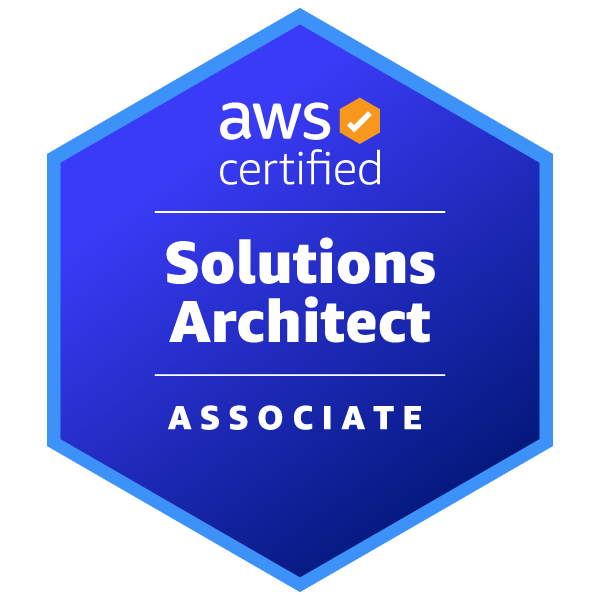
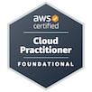

  

## **Who** am I?

I'm a **Software Engineer & Cloud/DevOps enthusiast** pursuing my **Master’s in Computer Science at RIT**. I love building scalable systems, automating development workflows, and designing cloud-native architectures that actually solve real-world problems.

---

### 🚀 About Me  
- 🎓 Graduate CS student @ **Rochester Institute of Technology**  
- 💼 Former **Software Engineer @ Vodafone** (Devops Engineer, ServiceNow automation, platform engineering)  
- 🔧 Currently a **Software Engineering Intern @ Excellus BlueCross BlueShield**, building production-grade Angular + ASP.NET features used by **1M+ members**  
- ☁️ Passionate about **Cloud Architecture, DevOps, Serverless, and CI/CD automation**  
- 🧩 I enjoy working across the stack — Frontend → Backend → Cloud → Automation  
- 🎶 Fun fact: My best debugging sessions happen while cooking with music on  
- 📬 Reach me at **cc5831@rit.edu**

---

### 🛠 Tech Stack  
### Languages

### Frameworks & Libraries

### Cloud & DevOps

### Databases

### ML / Data

**Certifications:** 

  
  

---

### 💼 Experience Snapshot  
- 🏥 **Excellus BCBS:**  
  Built 9+ production features in first month, developed scalable APIs on Azure Cosmos DB, resolved security vulnerabilities, and contributed end-to-end across CI/CD, reviews, and cloud deployments.

- 🌐 **Vodafone:**  
  Developed 20+ scalable ServiceNow applications with JavaScript & REST integrations, automated service desk operations achieving a 30% manual workload reduction, and implemented CI/CD pipelines with automated validations to ensure consistent, reliable configuration deployments.

---

### 🚧 Featured Project  
#### **🍽 Cloud-Native Nutrition Platform** (AWS, Terraform, GitHub Actions)  
A serverless nutrition tracking system that extracts macronutrients from food label images, generates personalized diet plans using LLMs, and deploys automatically using fully modular Terraform + CI/CD pipelines.

  

---

### 🌱 What I’m Learning Now 
- More into Full-Stack Development 
- Advanced AWS serverless patterns  
- Infrastructure-as-code best practices  
- Scaling CI/CD automation for multi-environment pipelines  

---

### 🤝 Let’s Connect  

  
  
  

