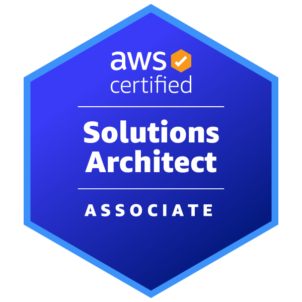
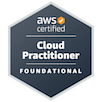

### Full-Stack Software Engineer + AI Engineer · MS CS @ RIT '26

> Currently shipping C#/Azure at Excellus BCBS · Building LangGraph agents for healthcare · Open to full-time SWE / AI Engineer roles

---

## About Me

I build production software where reliability actually matters — healthcare, telecom, regulated systems. Three years in, I've learned the unglamorous truth: the engineers teams trust aren't the ones who write the cleverest code, they're the ones who ask the right questions before writing any.

That's the lane I work in. Java, C#, Python microservices. Cloud-native systems that hold up under real load. AI/ML where it removes friction instead of adding ceremony.

- 🏥 **SWE Intern @ Excellus BCBS** — Shipping C# across 5 Azure Functions + ASP.NET Core APIs powering 1,000+ daily Rx operations. Cut Azure DevOps pipeline time **35% (12 → 8 min)** and broken builds **~30%** via pre-commit Jest hooks.
- 🌐 **Former SWE @ Vodafone (_VOIS)** — Owned CI/CD across 7 microservices, built event-driven ServiceNow automation processing **~5,000 tickets/month** (saved support ~7 hrs/week), and reduced MTTR using ELK observability dashboards.
- 🤖 **Built [TriageAI](https://github.com/chetanchandane/TriageAI)** — Autonomous LangGraph + MCP agent for clinical inbox triage. Reduced false-positive emergency alerts **84%** while holding **100% safety recall** across 1.6M+ tokens of stress testing. Designed for 2026 FDA CDS compliance.
- ☁️ **AWS Certified Solutions Architect Associate** + **Cloud Practitioner** · Terraform, Docker, GitHub Actions, Azure DevOps
- 🎶 Best debugging happens with Hans Zimmer on loop. Worst debugging happens at 2am — but Claude and Copilot make it bearable.
- 🌐 **Portfolio:** [chetanchandane.vercel.app](https://chetanchandane.vercel.app) · 📬 **cc5831@rit.edu**

---

### 🛠 Tech Stack

**Languages**

**Frameworks & Libraries**

**AI / ML**

**Cloud & DevOps**

**Databases**

**Certifications**

---

### 🚧 Featured Projects

**🏥 [TriageAI — Autonomous Clinical Inbox Triage](https://github.com/chetanchandane/TriageAI)**
Autonomous agentic state machine built with LangGraph + Model Context Protocol (MCP) for safely automating clinical inbox triage. Reduced false-positive emergency alerts **84%** while maintaining **100% safety recall** across 1.6M+ tokens of stress testing. Designed for 2026 FDA CDS compliance with human-in-the-loop investigative copilot patterns.
`LangGraph` `MCP` `Python` `LLMs` `Healthcare AI`

**🍽 [NutriAI — Serverless Nutrition Platform on AWS](https://github.com/chetanchandane/cloud-native-aws-application)**
End-to-end serverless system that extracts macronutrients from food labels and generates LLM-powered diet plans. 6 Terraform modules (compute, networking, storage, IAM, monitoring) with full dev/prod parity. Load-tested to **1,000+ concurrent requests at 99.9% uptime** with sub-second warm Lambda latency.
`AWS Lambda` `Terraform` `GitHub Actions` `Python`

**📝 [GitHub2Blog — Agentic Repo-to-Blog Pipeline](https://github.com/chetanchandane/agentic-github2blog)**
Agentic AI system that analyzes a GitHub repo's structure and commit history, then auto-generates a technical blog post in Markdown — with optional Dev.to publishing. Built as a one-shot tool to turn shipped work into shareable writing.
`LangChain` `Python` `Dev.to API`

**🔔 [Watcher — Zero-Cost Job Alert Automation](https://github.com/chetanchandane/watcher)**
Persistent Microsoft careers job alert running entirely on free tier. Scrapes role listings, deduplicates, and pushes notifications without a single dollar of infrastructure cost.
`Python` `GitHub Actions` `Web Scraping`

---

### 🌱 Currently Exploring

- **Eval pipelines for AI agents** — moving beyond vibes-based testing for LangGraph systems
- **Azure Durable Functions + Event Grid** — orchestrating long-running workflows in serverless
- **Production-grade RAG** — chunking strategies, retrieval evaluation, hybrid search
- **MCP server design patterns** — the protocol post-Claude 4

---

### 🎯 What I'm Looking For

Full-time **Software Engineer (Full-Stack)** or **AI Engineer** roles, US-based, available **May 2026**.

Especially excited about teams shipping AI into regulated industries — healthcare, finance, govtech — where reliability and safety actually matter. If that's you, let's talk.

---

### 🤝 Connect

Last updated: May 2026 · Open to opportunities · DMs welcome

